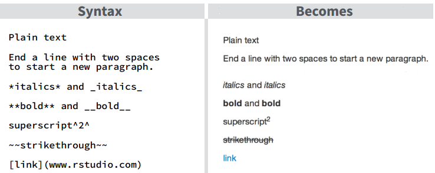

```{r setup, include=FALSE}
knitr::opts_chunk$set(echo = TRUE)
knitr::opts_chunk$set(cache = TRUE)
```

## R Markdown

This is an R Markdown document. Markdown is a simple formatting syntax for authoring HTML, PDF, and MS Word documents. 

For more details on using R Markdown see <http://rmarkdown.rstudio.com>.

When you click the **Knit...** button a document will be generated that includes both content as well as the output of any embedded R code chunks within the document. You can embed an R code chunk like this:

```{r package-load, message=T}
library(dplyr)
library(ggplot2)
```

## Including Plots

You can also embed plots, for example:

```{r echo=T, fig.height=3.5}
ggplot(
  data = sample_n(diamonds, 10000) %>% #sample, diamonds is qutie large
    mutate(volume = x*y*z), 
  aes(
    x = volume,
    y = price,
    colour = color,
    size = carat
  )
) + 
  geom_point(alpha = 0.05) +
  scale_x_log10() +
  scale_y_log10() +
  guides(colour = guide_legend(override.aes= list(alpha = 0.9, size = 6)),
         size   = guide_legend(override.aes= list(alpha = 0.9))) 
```


### Code Chunks, and Options

R code chunks can be used as a means render R output into documents, or to simply display code for illustration. 

[Full details online here http://rmarkdown.rstudio.com/authoring_rcodechunks.html](http://rmarkdown.rstudio.com/authoring_rcodechunks.html)


Here are a few examples. Refer to the `.Rmd` r-markdown file associated with this document for the full mapping how your codes maps to the final rendered document.  

We'll run the following code chuck.  Note the code chuck is encapsulated by three grave marks (`` ` ``, it's below the `~` on your keyboard) indicating the start and end of the chunk. The `{r}` indicates which language you want to run. You can also run python, c++, and other languages.

  ```{r}
  summary(diamonds$carat)
  ```

```{r}
summary(diamonds$carat)
```

Returned is the summary table for the vector `diamonds$carat`.  

***

**`eval`** is a handy option to control weather or not your r code is executed. 

`eval=TRUE` (the default setting), will both shows your code and run it.  

`eval=FALSE` will show the code, but the code won't be run. This is often handy if you want to discuss code, but not actually run anything.

```{r echo = F, comment = "", highlight = TRUE}
cat("```{r, eval=TRUE}\n summary(diamonds$price)\n```")
```

Now, eval = F

```{r, eval = F}
print("Hello World!")
```

```{r echo = F}
summary(diamonds$price)
```

And look at that, with eval set to `TRUE`, your code is run. 

***

**`echo`** is another handy option to control how your code chuck is handled by your r-markdown document. 

The default is for `echo=TRUE`, which runs your code chunk and prints the chunk out. 

`echo=FALSE` runs the code, but doesn't show it. This is handy for plots and tables and large code blocks you don't want taking up too much space, or too much attention drawn to, in your final polished document. 

This code is being run with `eval=TRUE`: 

  ```{r, eval=TRUE}
  summary(diamonds$price)
  ```

And it returns: 

```{r echo = T}
summary(diamonds$price)
```


Now, with `echo=FALSE`

```{r echo = F}
summary(diamonds$price)
```

Your code chunk is run, and the summary is produced, but the code chunk isn't printed. 


***

**Error and Warning Handling** - a lot of your code might produce error or warning messages. One example is with loading certain packages. 


```{r, echo = T}
warning("warning")
```

Note all the warning messages about masked functions. You can turn this off with the warning option. 

By default you will get all warning and error messages, so to turn them off set them to FALSE

  ```{r, warning = F}
  library(dplyr)
  ```

```{r, echo = T, warning = F}
warning("warning")
```


### Markdown Basics

[Full list here http://rmarkdown.rstudio.com/authoring_basics.html](http://rmarkdown.rstudio.com/authoring_basics.html)




## Global Options

Your document will often take longer and longer to render as it deals with more data and more complex analysis. You can speed this rendering process up by cashing. Note this is done at the top of the the `.Rmd` file for this document. 


```{r echo = F, comment = "", highlight = TRUE}
cat("```{r setup, include=FALSE}\nknitr::opts_chunk$set(cache=TRUE)\n```")
```

See more options under `?opts_chunk`, and [discussion here](http://yihui.name/knitr/options#chunk_options). 

## Plot Options

See the [r markdown cheatsheet for details](http://www.rstudio.com/wp-content/uploads/2015/03/rmarkdown-reference.pdf)

Turn PDF global settings on, 

```{r, eval=F}
---
title: "Untitled"
author: "Nicholas"
date: "20/09/2014"
output:
  pdf_document:
    fig_caption: yes
---
```

The options set are `{r, fig.height = 3., fig.width=6, fig.cap = "Diamond prices by cut, ggplot violin plus jitter"}`

```{r, fig.height = 3., fig.width=6, fig.cap = "Diamond prices by cut, ggplot violin plus jitter"}

	ggplot(
	  data = sample_n(diamonds, 10000), 
	       aes(x = cut, y = price)) +
  geom_violin() +
  geom_jitter(alpha = 0.05)
```
